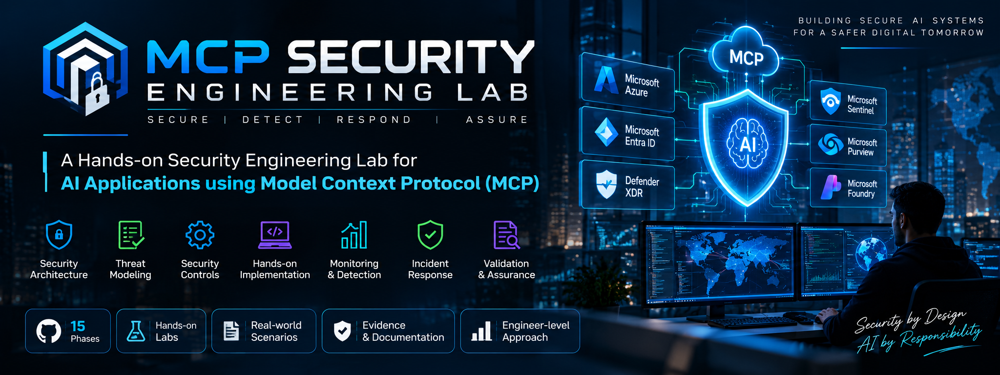
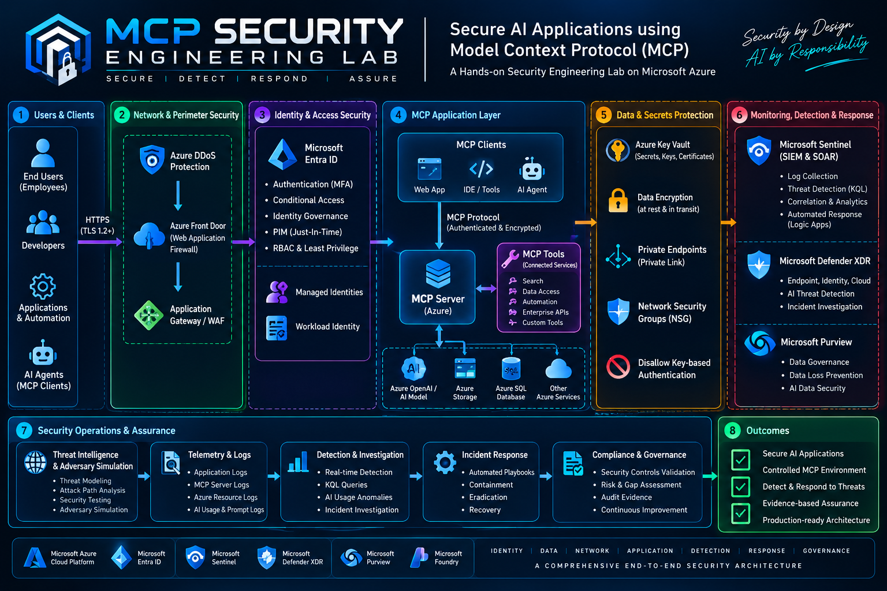
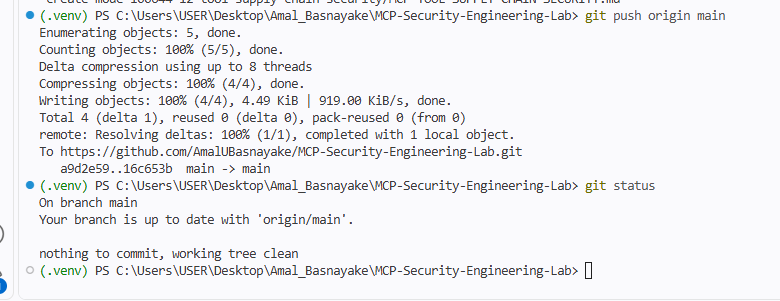
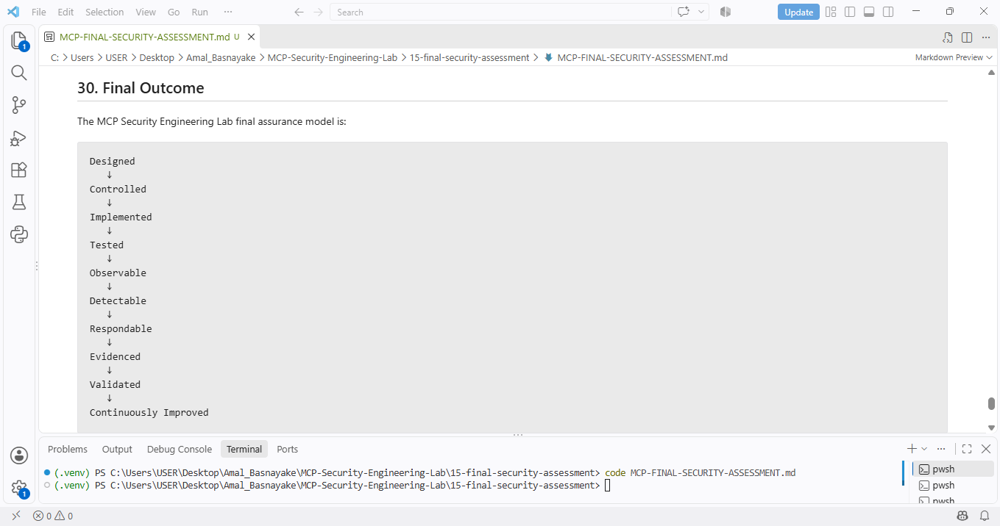
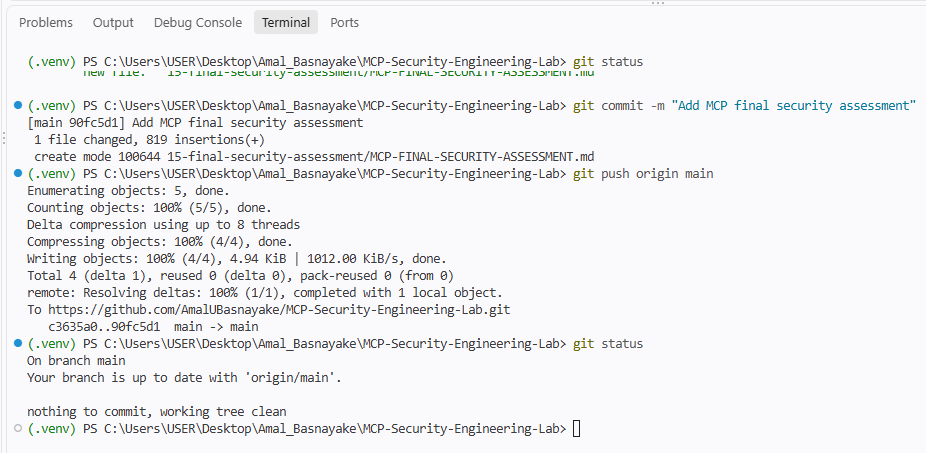

# 🛡️ MCP Security Engineering Lab

<p align="center">
  
</p>

<p align="center">
  <strong>Secure • Detect • Respond • Assure</strong>
</p>

<p align="center">
  A hands-on security engineering laboratory for securing AI applications using the Model Context Protocol (MCP).
</p>

---

## 📌 Project Overview

The **MCP Security Engineering Lab** is an engineering-focused security project that treats MCP security as an end-to-end system rather than a collection of isolated controls.

The project connects:

```text
Architecture
      ↓
Threat Model
      ↓
Asset Inventory
      ↓
Attack Paths
      ↓
Security Controls
      ↓
Implementation
      ↓
Validation
      ↓
Monitoring
      ↓
Detection
      ↓
Incident Response
      ↓
Identity & Session Security
      ↓
Secrets & Data Protection
      ↓
Tool & Supply-Chain Security
      ↓
SIEM & Detection Correlation
      ↓
Adversary Simulation
      ↓
Final Security Assessment
```

The objective is to demonstrate how a security requirement moves from **design → implementation → testing → telemetry → detection → response → evidence → assurance**.

---

## 🏗️ End-to-End Security Architecture

<p align="center">
  
</p>

<p align="center"><em>Figure 2 — End-to-end MCP Security Engineering Lab architecture showing identity, MCP application, data and secrets protection, monitoring, incident response, and assurance layers.</em></p>

The architecture uses explicit security boundaries around:

- Client and identity context
- MCP server and tool execution
- Authorization and allowlisting
- Input validation
- Data and secret protection
- Telemetry and detection
- Incident response
- Evidence and assurance

---

## 🧭 Engineering Model

The lab follows a control-validation model:

```text
What are we protecting?
        ↓
What can go wrong?
        ↓
Which security boundary is involved?
        ↓
Which control should enforce the boundary?
        ↓
How do we test it?
        ↓
How do we observe it?
        ↓
How do we detect abuse?
        ↓
How do we respond?
        ↓
What evidence proves the behavior?
        ↓
What residual gaps remain?
```

A control is not treated as complete merely because it is documented.

The engineering lifecycle is:

```text
Defined
   ↓
Implemented
   ↓
Tested
   ↓
Observed
   ↓
Recorded
   ↓
Reproducible
```

---

# 📚 15-Phase Security Engineering Roadmap

| Phase | Domain | Engineering Outcome |
|---|---|---|
| `01-architecture` | Security Architecture | Security boundaries and architecture |
| `02-threat-model` | Threat Modeling | Threats and trust boundaries |
| `03-assets` | Asset Inventory | Security-relevant assets |
| `04-attack-paths` | Attack Analysis | Abuse and attack paths |
| `05-security-controls` | Security Controls | Preventive and detective controls |
| `06-mcp-server` | MCP Implementation | MCP server and validation harness |
| `07-evidence` | Security Validation | Validation record and evidence |
| `08-monitoring-detection` | Detection Engineering | Telemetry, DET-01, DET-02, PB-01, PB-02 |
| `09-incident-response` | Incident Response | Investigation and response model |
| `10-identity-session-security` | Identity Security | Identity, authorization, session model |
| `11-secrets-data-protection` | Data Protection | Secret and data protection model |
| `12-tool-supply-chain-security` | Supply Chain | Tool trust and dependency controls |
| `13-siem-detection-correlation` | SIEM | Correlation and alert enrichment |
| `14-adversary-simulation` | Adversary Simulation | Controlled control-testing scenarios |
| `15-final-security-assessment` | Assurance | Final assessment and residual gaps |

---

# 🔐 Security Validation

The MCP server security validation layer includes controlled tests for:

```text
Approved Component
        ↓
Uppercase + Whitespace Normalization
        ↓
Unknown Component Rejection
        ↓
Empty Input Rejection
        ↓
Path-like Input Rejection
```

The recorded automated validation result was:

```text
Security test summary: 5/5 passed.
```

This demonstrates that the implemented input and authorization controls were exercised using a repeatable local test harness.

---

# 🔎 Detection Engineering

## DET-01 — Repeated Authorization Failure

Controlled telemetry is correlated to detect repeated denied authorization attempts.

```text
DENIED Request
      ↓
Same Identity
      ↓
Repeated Attempts
      ↓
5-Minute Window
      ↓
DET-01
      ↓
HIGH Alert
```

Example detection model:

```text
Threshold : 3 failures
Window    : 5 minutes
Severity  : HIGH
```

## DET-02 — Unauthorized Component Access

DET-02 detects denied requests targeting components outside the approved allowlist.

```text
Unauthorized Component
        ↓
Authorization DENIED
        ↓
Telemetry
        ↓
DET-02
        ↓
HIGH Alert
```

<p align="center">
  
</p>

<p align="center"><em>Figure 3 — DET-02 validation output showing repeated unauthorized component access events, DENIED decisions, and the <code>component_not_in_allowlist</code> security reason.</em></p>

The evidence captures:

```text
Detection ID : DET-02
Severity     : HIGH
Events       : 3
Identity     : test-identity
Component    : unknown-component
Decision     : DENIED
Reason       : component_not_in_allowlist
```

---

# 🧩 Response Engineering

Detection rules are connected to response playbooks:

| Detection | Playbook | Purpose |
|---|---|---|
| DET-01 | PB-01 | Repeated authorization failure response |
| DET-02 | PB-02 | Unauthorized component access response |

Response workflow:

```text
Alert
   ↓
Triage
   ↓
Investigation
   ↓
Containment
   ↓
Evidence Preservation
   ↓
Recovery
   ↓
Validation
```

---

# 🪪 Identity & Session Security

The identity security model establishes:

```text
Authenticated
      ↓
Authorized
      ↓
Session-Bound
      ↓
Tool-Scoped
      ↓
Resource-Scoped
      ↓
Observable
      ↓
Revocable
```

Key design areas include:

- Authentication context
- Authorization context
- Session boundaries
- Identity-aware telemetry
- Tool-scoped authorization
- Resource-scoped authorization
- Session termination

---

# 🔑 Secrets & Data Protection

The secrets and data protection model covers:

```text
Secret
  ↓
Protected Storage
  ↓
Least-Privilege Retrieval
  ↓
Minimal Exposure
  ↓
Safe Processing
  ↓
Redacted Telemetry
  ↓
Rotation / Revocation
```

Security principles include:

- Do not hard-code real credentials
- Do not place secrets in logs
- Use redaction for sensitive telemetry
- Minimize sensitive data processing
- Validate output before release
- Rotate or revoke exposed credentials

---

# 📦 Tool & Supply-Chain Security

Tool trust is modeled as:

```text
Known Tool
   ↓
Trusted Source
   ↓
Verified Version
   ↓
Assessed Dependencies
   ↓
Verified Integrity
   ↓
Approved Capability
   ↓
Least-Privilege Execution
   ↓
Runtime Monitoring
   ↓
Change Detection
```

Coverage includes allowlisting, dependency inventory, version control, integrity validation, capability review, and change detection.

---

# 📊 SIEM & Detection Correlation

The correlation layer transforms individual events into investigation-ready security signals:

```text
Event
  ↓
Normalization
  ↓
Context Enrichment
  ↓
Correlation
  ↓
Detection
  ↓
Alert
  ↓
Investigation
  ↓
Response
  ↓
Evidence
```

Correlation dimensions include identity, session, tool, component, resource, timestamp, event type, and authorization decision.

---

# 🧪 Adversary Simulation

The lab uses controlled, non-destructive simulations to exercise security controls.

Example scenarios include:

```text
AS-01  Unauthorized Component Access
AS-02  Suspicious Input
AS-03  Repeated Authorization Failure
AS-04  Session Abuse
AS-05  Unauthorized Tool Invocation
AS-06  Synthetic Secret Exposure
AS-07  Dependency Change
AS-08  Integrity Mismatch
AS-09  Configuration Change
AS-10  Multi-Signal Activity
```

Simulation philosophy:

> Adversary simulation should validate controls, not simply demonstrate attacks.

---

# 📋 Final Security Assessment

The final assurance model connects every engineering layer:

```text
Architecture
     ↓
Threat Model
     ↓
Security Controls
     ↓
Implementation
     ↓
Security Tests
     ↓
Detection
     ↓
Response
     ↓
Evidence
     ↓
Residual Gaps
     ↓
Final Assurance
```

The assessment explicitly distinguishes demonstrated laboratory behavior from production capabilities that require deployment-specific validation.

<p align="center">
  
</p>

<p align="center"><em>Figure 4 — Final security assessment evidence showing the laboratory assurance outcome and the final engineering validation stage.</em></p>

---

# 🧾 Evidence & Auditability

The project maintains an evidence-driven workflow:

```text
Control
   ↓
Test
   ↓
Expected Result
   ↓
Observed Result
   ↓
Telemetry
   ↓
Detection
   ↓
Response
   ↓
Validation
```

Selected evidence demonstrates:

- Workspace creation for each engineering phase
- Security model documentation
- Automated security testing
- DET-01 and DET-02 detections
- Response playbooks
- SIEM correlation model
- Adversary simulation model
- Final assessment
- Git commit and repository synchronization

---

# ✅ Repository Integrity

The final repository was synchronized with the GitHub `main` branch after the final assessment commit.

<p align="center">
  
</p>

<p align="center"><em>Figure 5 — Final Git verification showing the repository synchronized with <code>origin/main</code> and a clean working tree.</em></p>

---

# 🗂️ Repository Structure

```text
MCP-Security-Engineering-Lab/
│
├── 01-architecture/
├── 02-threat-model/
├── 03-assets/
├── 04-attack-paths/
├── 05-security-controls/
├── 06-mcp-server/
├── 07-evidence/
├── 08-monitoring-detection/
├── 09-incident-response/
├── 10-identity-session-security/
├── 11-secrets-data-protection/
├── 12-tool-supply-chain-security/
├── 13-siem-detection-correlation/
├── 14-adversary-simulation/
├── 15-final-security-assessment/
│
├── assets/
│   ├── mcp-security-lab-banner.png
│   ├── figure-02-mcp-security-architecture.png
│   ├── figure-03-det02-validation.png
│   ├── figure-04-final-security-assurance.png
│   └── figure-05-git-final-clean.png
│
├── .gitignore
├── LICENSE
└── README.md
```

---

# 🛠️ Technology Stack

| Area | Technologies |
|---|---|
| Language | Python |
| MCP | MCP Python SDK |
| Inspection | MCP Inspector |
| Automation | Python / PowerShell |
| Telemetry | JSONL |
| Detection | Python detection logic |
| Source Control | Git / GitHub |
| Documentation | Markdown |
| Security Concepts | IAM, least privilege, SIEM, SOAR, supply chain, incident response |

---

# ▶️ Working With the Lab

Typical Python validation:

```powershell
python -m py_compile <file>.py
python <file>.py
```

Typical Git workflow:

```powershell
git status
git add <path>
git commit -m "<message>"
git push origin main
```

Run only the controlled security scenarios documented in the project.

---

# ⚠️ Scope & Limitations

This is a **laboratory security engineering project**.

It does not by itself represent:

- A production security deployment
- A certification
- An independent audit
- A production penetration test
- A complete enterprise SIEM/SOAR deployment
- A complete production identity platform
- A complete enterprise secret-management platform
- A complete software supply-chain governance platform

Production deployment requires environment-specific architecture, operations, compliance, and security validation.

All adversary simulations should remain authorized, controlled, and non-destructive.

---

# 🎓 Engineering Outcomes

This project demonstrates an end-to-end approach to MCP security engineering:

```text
Design
  ↓
Threat Modeling
  ↓
Control Engineering
  ↓
Implementation
  ↓
Validation
  ↓
Detection
  ↓
Response
  ↓
Assurance
```

The core focus is **engineer thinking**:

> Understand why the control exists, implement the control, test its behavior, observe its telemetry, detect failure, respond to the event, preserve the evidence, and validate the outcome.

---

# 🌐 Repository

**GitHub:**  
https://github.com/AmalUBasnayake/MCP-Security-Engineering-Lab

---

# 📜 License

This project is licensed under the MIT License. See [`LICENSE`](LICENSE).

---

## 🛡️ Security Engineering Principle

> **Build the control. Test the control. Observe the control. Detect the failure. Respond to the event. Preserve the evidence. Validate the outcome.**

<p align="center">
  <strong>MCP Security Engineering Lab — Laboratory Assurance Scope</strong>
</p>
